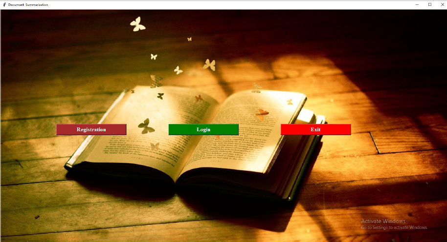

# Abstractive Document Summarization Using Machine Learning Approach

We present a novel divide-and-conquer strategy for neural summary of large
documents. Our solution makes use of the document’s discourse structure
and sentence similarity.Divide the task into smaller summarization chal-
lenges.We divide a lengthy document and its summary into numerous source-
target pairs, which are then used to train a model. learns to sum up each
section of the document individually After The partial summaries are then
combined to form a final comprehensive summary. In contrast to the con-
ventional approach, we may break down the challenge of long document
summary into smaller pieces and simpler problems, reducing computational
complexity and increasing the number of training examples while also reduc-
ing There is noise in the target summaries. There are two publicly available
datasets.
Keywords: Summarization, Machine Learning, Classification, NLP (Natu-
ral Language Processing) etc.


## Tools and Technologies Used

**Operating system** : Windows 10 and above.  
**Coding Language** : Python.  
**IDE** : Spyder.  
**Database** : SQLite  
**Technologies Used** : Anaconda Navigator(Spyder)  
**Libraries are used:**
1. Keras
2. pillow
3. Tensorflow
4. Matplotlib
5. opencv
## Installation
1. To get the source code and required files locally  
1.1 Clone the repository:

```bash
    git clone https://github.com/Purushottam286/Text-Summarization.git
```
1.2 Navigate to project directory

```bash
    cd Text-Summarization
```
1.3 Install the dependencies:
```bash
    pip install -r requirements.txt
```
2. Installation and un-installation

Anaconda Navigator Installtion step  
2.1 Go to the Anaconda Website and choose a Python 3.  
2.2 Locate your download and double click it.  
2.3 Read the license agreement and click on I Agree.  
2.4 Click on Next.  
2.5 Note your installation location and then click Next.  
2.6 This is an important part of the installation process.  
2.7 Click on Next.  
2.8 then you install the libraries pillow,opencv,keras,matplotlib,tensorflow  

Anaconda Navigator Uninstalltion step:  
go to the control panel select the anaconda navigator then Uninstall.  

3. Execution 
For more details on how to use this project, refer to the [procedure document](execution-procedure.pdf).

## Screenshots



## License

This project is licensed under the MIT License - see the [LICENSE](https://choosealicense.com/licenses/mit/) file for details.
## Contributing
Thank you for considering contributing to this project! Contributions are what make open-source software such a great place to learn, inspire, and create. By contributing to this repository, you agree to adhere to the following guidelines.

### How to Contribute:
1. **Fork the Repository**.
2. **Clone Your Fork**.
    ```bash
   git clone https://github.com/your-username/Text-Summarization.git
3. **Create a Branch**.
    ```bash
    git checkout -b feature-name
4. **Make Changes**
5. **Commit Changes**
    ```
    git commit -m "Your message describing the change"
6. **Push to Your Fork**
    ```
    git push origin feature-name
7. **Open a Pull Request**

### Guidelines:
- Ensure that your code is well-documented.
- Write clear commit messages.
- Before submitting, ensure that your changes pass all tests.
### Reporting Issues:
If you encounter any bugs or issues, please open an issue in the Issues section.
### Code of Conduct:
We expect all contributors to follow the `Code of Conduct`.


## Acknowledgements

- Thanks to **Keras** for providing a user-friendly interface for building neural network models.
- **Pillow** was used for image processing during some of the visual tasks in this project.
- **TensorFlow** was the core machine learning framework used to train the summarization models.
- **Matplotlib** helped visualize the data and results, making it easier to understand the model performance.
- **OpenCV** was used for image processing tasks related to visual elements of the project.
- Kanchan Pradhan – For their constant guidance, valuable feedback, and support throughout the development of this project.

- Special thanks to the open-source community for continuously contributing to these powerful libraries.
- GitHub for version control and open-source collaboration.
## Contact

- **Your Name**: Purushottam Nimje
- **Email**: purushottamnimje286@gmail.com
- **GitHub**: [Purushottam286](https://github.com/Purushottam286)
## Thank You!

Thank you for taking the time to check out this project! Feel free to contribute, suggest improvements, or report any issues. Your feedback is always welcome. 😊

Happy coding and good luck with your text summarization tasks! ✨
